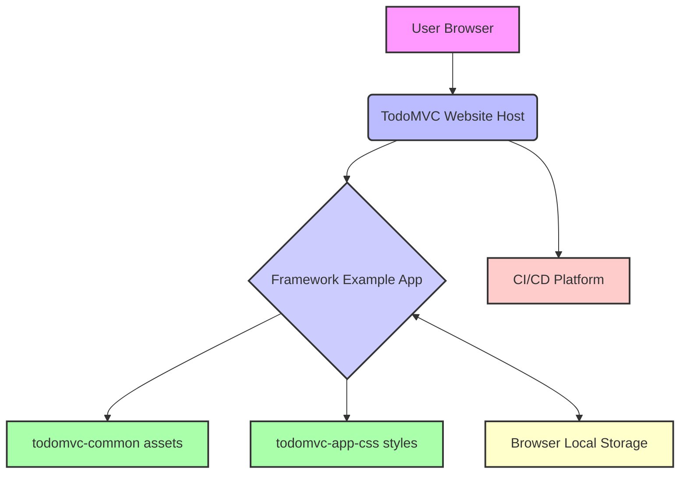
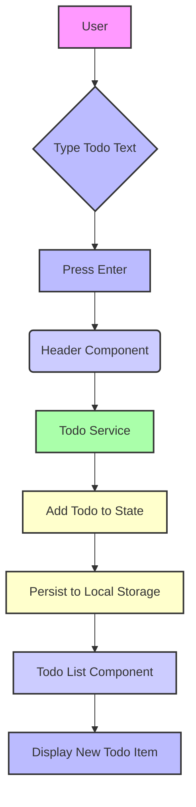
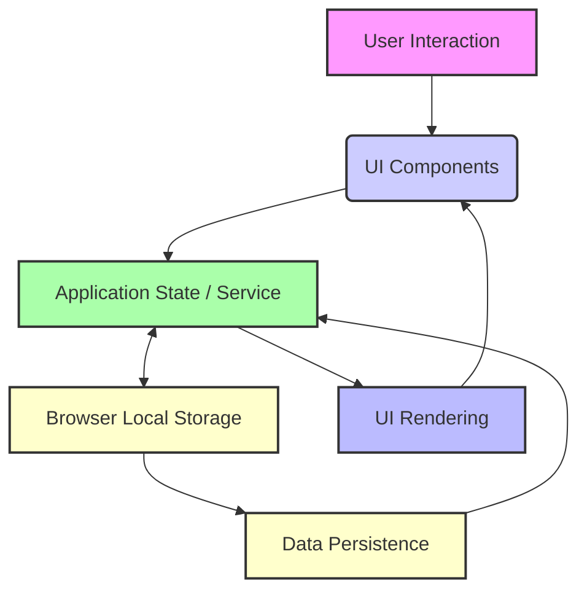
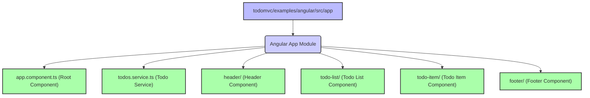
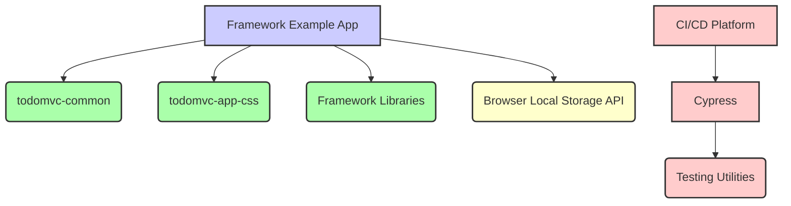
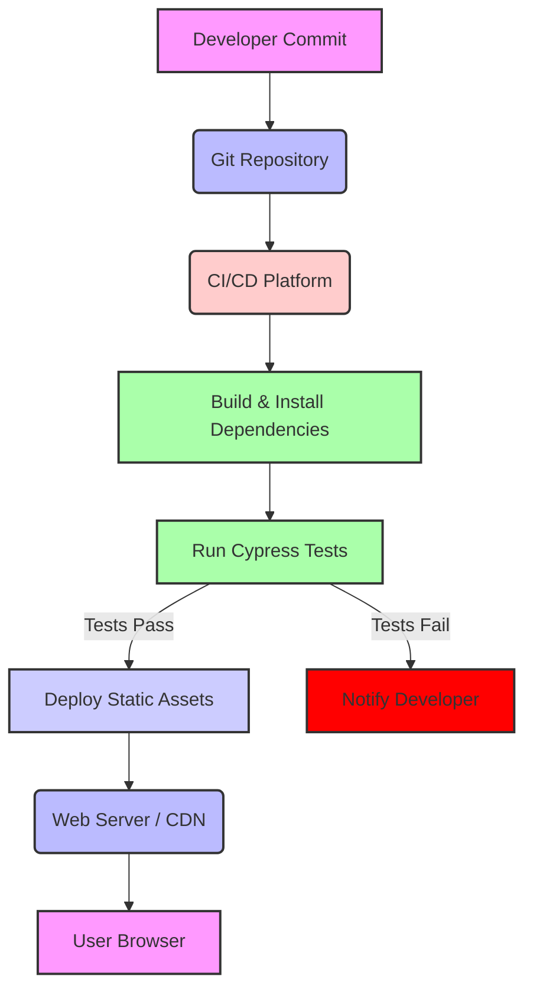

## 1. System Architecture Overview

```mermaid
graph TD
    A["User Browser"] --> B(TodoMVC Website Host);
    B --> C{Framework Example App};
    C --> D["todomvc-common assets"];
    C --> E["todomvc-app-css styles"];
    C <--> F["Browser Local Storage"];
    B --> G["CI/CD Platform"];

    style A fill:#f9f,stroke:#333,stroke-width:2px
    style B fill:#bbf,stroke:#333,stroke-width:2px
    style C fill:#ccf,stroke:#333,stroke-width:2px
    style D fill:#afa,stroke:#333,stroke-width:2px
    style E fill:#afa,stroke:#333,stroke-width:2px
    style F fill:#ffc,stroke:#333,stroke-width:2px
    style G fill:#fcc,stroke:#333,stroke-width:2px
```

## 2. User Flow

```mermaid
graph TD
    A["User"] --> B{Type Todo Text};
    B --> C["Press Enter"];
    C --> D(Header Component);
    D --> E["Todo Service"];
    E --> F["Add Todo to State"];
    F --> G["Persist to Local Storage"];
    G --> H["Todo List Component"];
    H --> I["Display New Todo Item"];

    style A fill:#f9f,stroke:#333,stroke-width:2px
    style B fill:#bbf,stroke:#333,stroke-width:2px
    style C fill:#bbf,stroke:#333,stroke-width:2px
    style D fill:#ccf,stroke:#333,stroke-width:2px
    style E fill:#afa,stroke:#333,stroke-width:2px
    style F fill:#ffc,stroke:#333,stroke-width:2px
    style G fill:#ffc,stroke:#333,stroke-width:2px
    style H fill:#ccf,stroke:#333,stroke-width:2px
    style I fill:#bbf,stroke:#333,stroke-width:2px
```

## 3. Data Flow

```mermaid
graph TD
    A["User Interaction"] --> B(UI Components);
    B --> C["Application State / Service"];
    C <--> D["Browser Local Storage"];
    D --> E["Data Persistence"];
    E --> C;
    C --> F["UI Rendering"];
    F --> B;

    style A fill:#f9f,stroke:#333,stroke-width:2px
    style B fill:#ccf,stroke:#333,stroke-width:2px
    style C fill:#afa,stroke:#333,stroke-width:2px
    style D fill:#ffc,stroke:#333,stroke-width:2px
    style E fill:#ffc,stroke:#333,stroke-width:2px
    style F fill:#bbf,stroke:#333,stroke-width:2px
```

## 4. Folder-to-Component Mapping

```mermaid
graph TD
    A["todomvc/examples/angular/src/app"] --> B(Angular App Module);
    B --> C["app.component.ts (Root Component)"];
    B --> D["todos.service.ts (Todo Service)"];
    B --> E["header/ (Header Component)"];
    B --> F["todo-list/ (Todo List Component)"];
    B --> G["todo-item/ (Todo Item Component)"];
    B --> H["footer/ (Footer Component)"];

    style A fill:#bbf,stroke:#333,stroke-width:2px
    style B fill:#ccf,stroke:#333,stroke-width:2px
    style C fill:#afa,stroke:#333,stroke-width:2px
    style D fill:#afa,stroke:#333,stroke-width:2px
    style E fill:#afa,stroke:#333,stroke-width:2px
    style F fill:#afa,stroke:#333,stroke-width:2px
    style G fill:#afa,stroke:#333,stroke-width:2px
    style H fill:#afa,stroke:#333,stroke-width:2px
```

## 5. Key Dependencies / Services

```mermaid
graph TD
    A["Framework Example App"] --> B(todomvc-common);
    A --> C(todomvc-app-css);
    A --> D(Framework Libraries);
    A --> E(Browser Local Storage API);
    F["Cypress"] --> G(Testing Utilities);
    H["CI/CD Platform"] --> F;

    style A fill:#ccf,stroke:#333,stroke-width:2px
    style B fill:#afa,stroke:#333,stroke-width:2px
    style C fill:#afa,stroke:#333,stroke-width:2px
    style D fill:#afa,stroke:#333,stroke-width:2px
    style E fill:#ffc,stroke:#333,stroke-width:2px
    style F fill:#fcc,stroke:#333,stroke-width:2px
    style G fill:#fcc,stroke:#333,stroke-width:2px
    style H fill:#fcc,stroke:#333,stroke-width:2px
```

## 6. Deployment Architecture

```mermaid
graph TD
    A["Developer Commit"] --> B(Git Repository);
    B --> C(CI/CD Platform);
    C --> D["Build & Install Dependencies"];
    D --> E["Run Cypress Tests"];
    E -- Tests Pass --> F["Deploy Static Assets"];
    F --> G(Web Server / CDN);
    G --> H["User Browser"];
    E -- Tests Fail --> I["Notify Developer"];

    style A fill:#f9f,stroke:#333,stroke-width:2px
    style B fill:#bbf,stroke:#333,stroke-width:2px
    style C fill:#fcc,stroke:#333,stroke-width:2px
    style D fill:#afa,stroke:#333,stroke-width:2px
    style E fill:#afa,stroke:#333,stroke-width:2px
    style F fill:#ccf,stroke:#333,stroke-width:2px
    style G fill:#bbf,stroke:#333,stroke-width:2px
    style H fill:#f9f,stroke:#333,stroke-width:2px
    style I fill:#f00,stroke:#333,stroke-width:2px
```